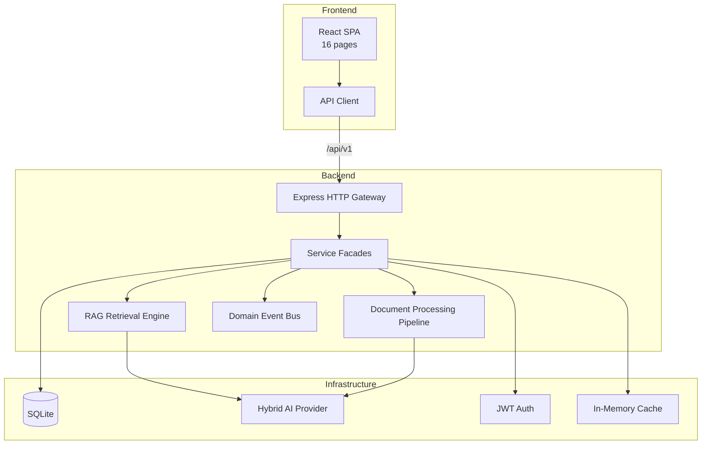

# SynapseIQ

**Enterprise AI Knowledge Intelligence Platform**

SynapseIQ is a full-stack SaaS application that helps teams turn scattered documents into a searchable, queryable intelligence layer. Instead of digging through folders, wikis, and email attachments, teams upload their knowledge into SynapseIQ, and an AI assistant answers questions grounded in that content — with source references, workspace isolation, and the admin tooling you'd expect from a production product.

> **In one sentence:** SynapseIQ is "ChatGPT for your company's documents" — built as a real multi-tenant product, not a demo script.

---

## Table of Contents

- [What Is SynapseIQ?](#what-is-synapseiq)
- [The Problem It Solves](#the-problem-it-solves)
- [Who Is It For?](#who-is-it-for)
- [How It Works](#how-it-works)
- [Use Cases](#use-cases)
- [Core Concepts](#core-concepts)
- [Features](#features)
- [Tech Stack](#tech-stack)
- [Architecture](#architecture)
- [Getting Started](#getting-started)
- [Demo Account](#demo-account)
- [Environment Variables](#environment-variables)
- [Project Structure](#project-structure)
- [Frontend Pages](#frontend-pages)
- [API Reference](#api-reference)
- [AI Configuration](#ai-configuration)
- [Scripts](#scripts)
- [Troubleshooting](#troubleshooting)
- [Production Notes](#production-notes)

---

## What Is SynapseIQ?

Modern teams drown in documents — product specs, research reports, architecture docs, meeting notes, policy PDFs. The information exists, but finding the right answer at the right time is slow, inconsistent, and depends on whoever remembers where things live.

SynapseIQ solves that by giving every team a **private AI knowledge workspace**:

1. **Upload** documents (PDFs, Markdown, text files, and more)
2. **Index** them automatically — chunked, embedded, and summarized by AI
3. **Ask** questions in natural language via a chat interface
4. **Get answers** grounded in your actual documents (RAG — Retrieval-Augmented Generation)
5. **Manage** access, usage, integrations, and API access like a real SaaS product

SynapseIQ is designed to feel like something you could ship tomorrow: a polished landing page, a full authenticated app with 16 pages, analytics dashboards, team management, billing UI, API keys, and a backend structured like an enterprise codebase — not a single-file tutorial.

---

## The Problem It Solves

| Without SynapseIQ | With SynapseIQ |
|-------------------|----------------|
| Knowledge lives in silos (Drive, Notion, email, Slack) | One searchable knowledge base per workspace |
| New hires ask the same questions repeatedly | AI answers from indexed docs instantly |
| Generic ChatGPT hallucinates about your company | RAG grounds every answer in your uploaded content |
| No visibility into who uses what | Analytics, activity logs, and token tracking |
| Hard to integrate AI into existing workflows | REST API + API keys for programmatic access |

**Institutional knowledge walks out the door when people leave.** SynapseIQ captures it in a durable, searchable system that the whole team can query — not just the person who wrote the doc.

---

## Who Is It For?

### Product & Strategy Teams
Upload research reports, roadmaps, and competitive analyses. Ask "What did we decide about pricing in Q4?" and get an answer sourced from your actual strategy docs.

### Engineering Teams
Index architecture documents, RFCs, and runbooks. New engineers onboard faster by asking the AI instead of pinging seniors on Slack.

### Operations & Compliance
Maintain policy documents and SOPs in one place. Team members get consistent answers; admins get audit logs of who accessed what.

### Founders & Startups
Get a credible AI knowledge product running locally without building from scratch — useful as a prototype, internal tool, or the foundation for a SaaS launch.

### Developers Learning Full-Stack AI
Study a realistic TypeScript monorepo with RAG, JWT auth, layered backend architecture, and a production-quality React frontend.

---

## How It Works

### The User Journey

```
Sign up → Create workspace → Upload documents → AI indexes them
    → Open AI Chat → Ask a question → Get a grounded answer with sources
    → View analytics → Invite teammates → Connect integrations
```

### What Happens When You Upload a Document

When a file is uploaded, SynapseIQ runs it through a **document processing pipeline**:

1. **Ingest** — File is stored and metadata recorded (title, size, mime type, uploader)
2. **Chunk** — Content is split into semantic segments (~1000 characters each)
3. **Embed** — Each chunk is converted to a vector embedding (OpenAI or local fallback)
4. **Summarize** — AI generates a short summary of the full document
5. **Index** — Chunks are stored and marked as searchable

The document status moves from `pending` → `processing` → `indexed`.

### What Happens When You Ask a Question (RAG)

When you send a message in AI Chat, SynapseIQ does not just call a generic LLM:

1. Your question is **embedded** into a vector
2. The system **searches** your workspace's indexed chunks for the most relevant passages
3. Those passages are assembled as **context**
4. The LLM receives: system prompt + your question + relevant document excerpts
5. The answer is returned with **source document IDs** so you know where the information came from

This is **Retrieval-Augmented Generation (RAG)** — the industry-standard approach for building AI that knows *your* data, not just the internet.

### Multi-Tenant Workspaces

Every user belongs to one or more **workspaces**. Each workspace is an isolated knowledge environment:

- Its own documents and conversations
- Its own team members and roles
- Its own analytics and API keys
- Its own integration connections

A user on the "Acme Intelligence" workspace cannot see documents from "Beta Corp Workspace."

---

## Use Cases

### Internal Knowledge Base
Replace or augment Confluence/Notion search with AI-powered Q&A. Upload your wiki exports and let the team query them conversationally.

### Customer Support Assist
Index product documentation and support playbooks. Support agents ask SynapseIQ instead of searching five different systems.

### Research Synthesis
Upload multiple research PDFs and reports. Ask cross-document questions like "What are the common themes across our customer interviews?"

### Meeting Prep
Before a board meeting, upload the board deck and financial summary. Ask "What are the key risks highlighted?" and get a instant brief.

### Developer Documentation Hub
Index README files, API specs, and architecture docs. Developers ask "How does our auth flow work?" and get answers from the actual codebase docs.

### SaaS Prototype / MVP Foundation
Use SynapseIQ as the starting point for your own AI knowledge product — the UI, backend, auth, billing pages, and API are already built.

---

## Core Concepts

| Concept | Description |
|---------|-------------|
| **Workspace** | An isolated tenant environment. All documents, chats, and settings belong to a workspace. |
| **Document** | An uploaded file that has been (or is being) processed and indexed. |
| **Chunk** | A segment of a document's text, stored with an embedding for semantic search. |
| **Conversation** | A chat thread between a user and the AI assistant. |
| **RAG** | Retrieval-Augmented Generation — the AI retrieves relevant doc chunks before answering. |
| **Embedding** | A numerical vector representation of text, used for semantic similarity search. |
| **Knowledge Base** | The collective indexed documents in a workspace, searchable and queryable. |
| **Role** | Access level: Owner, Admin, Member, or Viewer — controls what a team member can do. |
| **API Key** | A programmatic access token for integrating SynapseIQ into external systems. |
| **Integration** | A connection to an external service (Slack, Notion, Google Drive, GitHub). |
| **Activity Log** | An audit trail of actions taken within a workspace. |

---

## Features

### Knowledge & AI
- **Document ingestion** — Upload PDF, Markdown, TXT, CSV, and DOC files (up to 10 MB)
- **Automatic chunking & indexing** — Documents are segmented, embedded, and summarized
- **RAG chat** — Ask questions in natural language; answers are grounded in your indexed documents
- **Semantic search** — Search across your entire knowledge base
- **Hybrid AI provider** — Works out of the box with a local fallback; plug in OpenAI for live responses

### Workspace & Collaboration
- **Multi-workspace support** — Create and switch between isolated workspaces
- **Role-based access** — Owner, Admin, Member, and Viewer roles
- **Team invitations** — Invite colleagues by email with granular permissions

### Enterprise Tooling
- **Analytics dashboard** — Track documents, queries, token usage, and active members over time
- **Activity audit log** — Full trail of workspace actions
- **API keys** — Programmatic access with hashed key storage
- **Integrations** — Slack, Notion, Google Drive, and GitHub connectors (UI + API)
- **Billing & plans** — Free, Pro, and Enterprise tier UI

### Developer Experience
- **Full TypeScript** — Backend and frontend written entirely in TypeScript
- **Monorepo** — Single `npm install` and `npm run dev` starts everything
- **Layered backend** — Hexagonal architecture with domain-driven design patterns
- **Zero native deps** — Uses Node.js built-in `node:sqlite` (no C++ build tools required)

---

## Tech Stack

| Layer | Technologies |
|-------|-------------|
| **Frontend** | React 18, TypeScript, Vite, Tailwind CSS, React Router, Recharts, Lucide Icons |
| **Backend** | Node.js, Express, TypeScript, Zod, JWT, bcrypt |
| **Database** | SQLite via Node.js built-in `node:sqlite` |
| **AI** | OpenAI API (optional) + local RAG fallback |
| **Dev Tools** | tsx, concurrently, Vite HMR |

---

## Architecture



### Backend Layers

```
backend/src/
├── bootstrap/          Entry point & startup
├── core/               Application kernel, orchestration, service registry
├── config/             Environment configuration
├── domain/             Entities, value objects, port interfaces
├── application/        Service facades, event handlers
├── infrastructure/     SQLite repos, AI adapters, auth, pipelines, cache
└── presentation/       HTTP routes, middleware, gateway factory
```

The backend follows **hexagonal (ports & adapters) architecture** with:
- **Domain layer** — Pure business entities and repository port interfaces
- **Application layer** — Service facades orchestrating use cases
- **Infrastructure layer** — SQLite persistence, OpenAI/local AI, JWT, event dispatching
- **Presentation layer** — REST API with auth middleware and validation

---

## Getting Started

### Prerequisites

- **Node.js 22+** (required for built-in `node:sqlite`)
- **npm 9+**

### Install & Run

```bash
cd synapseiq
npm install
npm run dev
```

| Service | URL |
|---------|-----|
| Frontend | http://localhost:5173 |
| Backend API | http://localhost:3001 |
| Health check | http://localhost:3001/api/v1/health |

On first run, the backend auto-creates `backend/data/synapseiq.db` and seeds demo data.

### Try It in 60 Seconds

1. Open http://localhost:5173
2. Click **View demo** or sign in with the demo account below
3. Explore the **Dashboard** — stats, charts, recent docs
4. Go to **Documents** — see pre-seeded sample files
5. Open **AI Chat** — start a conversation and ask about your knowledge base
6. Visit **Analytics**, **Team**, **Integrations**, and other pages

---

## Demo Account

| Field | Value |
|-------|-------|
| Email | `demo@synapseiq.io` |
| Password | `demo1234` |
| Workspace | Acme Intelligence (Pro plan) |

The demo workspace ships with pre-seeded documents (Q4 Product Strategy, Customer Research Report, Engineering Architecture), 14 days of analytics history, and a sample conversation — so every page has real data to explore immediately.

---

## Environment Variables

`backend/.env` is **not committed** (secrets stay out of git). After clone or download, run `npm install` or `npm run dev` — both auto-create `backend/.env` from `backend/.env.example`. In development, a safe default `JWT_SECRET` is also applied if the file is missing.

To customize manually:

```bash
cp backend/.env.example backend/.env
```

| Variable | Default | Description |
|----------|---------|-------------|
| `PORT` | `3001` | Backend server port |
| `NODE_ENV` | `development` | Runtime environment |
| `JWT_SECRET` | *(required)* | Secret for signing JWT tokens |
| `JWT_EXPIRES_IN` | `7d` | Token expiration |
| `OPENAI_API_KEY` | *(empty)* | OpenAI key for live AI responses |
| `DATABASE_PATH` | `./data/synapseiq.db` | SQLite database file path |
| `CORS_ORIGIN` | `http://localhost:5173` | Allowed frontend origin |

---

## Project Structure

```
synapseiq/
├── package.json                 # Root monorepo scripts
├── README.md
│
├── backend/
│   ├── package.json
│   ├── tsconfig.json
│   ├── .env.example
│   └── src/
│       ├── bootstrap/           # Application entrypoint
│       ├── core/                # Kernel, orchestrator, registry
│       ├── config/              # Env config (Zod-validated)
│       ├── domain/              # Entities, ports, value objects
│       ├── application/         # Service facades, event handlers
│       ├── infrastructure/      # DB, AI, auth, pipelines, cache
│       ├── presentation/        # HTTP layer (routes, middleware)
│       └── shared/              # Errors, API response types
│
└── frontend/
    ├── package.json
    ├── tsconfig.json
    ├── vite.config.ts           # Dev proxy → backend :3001
    ├── tailwind.config.js
    ├── index.html
    └── src/
        ├── main.tsx
        ├── App.tsx               # Route definitions
        ├── lib/api.ts            # Typed API client
        ├── context/              # Auth context provider
        ├── components/           # Layout, protected routes
        ├── pages/                # 16 page components
        └── styles/               # Tailwind + custom CSS
```

---

## Frontend Pages

| Page | Route | Description |
|------|-------|-------------|
| Landing | `/` | Marketing page with features & pricing |
| Login | `/login` | Authentication |
| Register | `/register` | Account + workspace creation |
| Dashboard | `/app/dashboard` | Overview stats, charts, quick actions |
| Documents | `/app/documents` | Upload, search, manage documents |
| Document Detail | `/app/documents/:id` | Summary, chunks, metadata |
| AI Chat | `/app/chat` | RAG-powered conversational interface |
| Knowledge Base | `/app/knowledge` | Semantic search & index overview |
| Analytics | `/app/analytics` | Usage charts and metrics |
| Team | `/app/team` | Member list & invitations |
| Workspaces | `/app/workspaces` | Create & switch workspaces |
| Activity | `/app/activity` | Audit log |
| Integrations | `/app/integrations` | Connect external services |
| API Keys | `/app/api-keys` | Generate & revoke keys |
| Billing | `/app/billing` | Plan comparison & subscription |
| Settings | `/app/settings` | Profile & notification preferences |

---

## API Reference

Base URL: `http://localhost:3001/api/v1`

All authenticated endpoints require:
```
Authorization: Bearer <jwt_token>
```

### Auth

| Method | Endpoint | Description |
|--------|----------|-------------|
| `POST` | `/auth/register` | Create account + workspace |
| `POST` | `/auth/login` | Sign in, receive JWT |
| `GET` | `/auth/me` | Get current user profile |
| `PATCH` | `/auth/me` | Update profile |

### Workspaces

| Method | Endpoint | Description |
|--------|----------|-------------|
| `GET` | `/workspaces` | List user's workspaces |
| `POST` | `/workspaces` | Create workspace |
| `GET` | `/workspaces/:id` | Workspace detail + members |
| `POST` | `/workspaces/:id/members` | Invite member |

### Documents

| Method | Endpoint | Description |
|--------|----------|-------------|
| `GET` | `/workspaces/:id/documents` | List documents (paginated) |
| `GET` | `/workspaces/:id/documents/search?q=` | Search documents |
| `POST` | `/workspaces/:id/documents/upload` | Upload file (multipart) |
| `GET` | `/documents/:id` | Document detail + chunks |
| `DELETE` | `/documents/:id` | Delete document |

### Conversations (RAG Chat)

| Method | Endpoint | Description |
|--------|----------|-------------|
| `GET` | `/workspaces/:id/conversations` | List conversations |
| `POST` | `/workspaces/:id/conversations` | Create conversation |
| `GET` | `/conversations/:id/messages` | Get messages |
| `POST` | `/conversations/:id/messages` | Send message (triggers RAG) |
| `DELETE` | `/conversations/:id` | Delete conversation |

### Analytics & Activity

| Method | Endpoint | Description |
|--------|----------|-------------|
| `GET` | `/workspaces/:id/analytics` | Dashboard metrics + snapshots |
| `GET` | `/workspaces/:id/activity` | Activity log (paginated) |

### API Keys & Integrations

| Method | Endpoint | Description |
|--------|----------|-------------|
| `GET` | `/workspaces/:id/api-keys` | List API keys |
| `POST` | `/workspaces/:id/api-keys` | Generate new key |
| `DELETE` | `/api-keys/:id` | Revoke key |
| `GET` | `/workspaces/:id/integrations` | List integrations |
| `POST` | `/workspaces/:id/integrations/:provider/connect` | Connect |
| `POST` | `/workspaces/:id/integrations/:provider/disconnect` | Disconnect |

Providers: `slack`, `notion`, `google_drive`, `github`

---

## AI Configuration

SynapseIQ uses a **hybrid AI strategy**:

1. **With OpenAI key** — Live embeddings (`text-embedding-3-small`) and chat completions (`gpt-4o-mini`)
2. **Without OpenAI key** — Local pseudo-embeddings and structured fallback responses (fully functional for demos)

To enable live AI, add your key to `backend/.env`:

```env
OPENAI_API_KEY=sk-your-key-here
```

Restart the backend after changing env vars.

### RAG Pipeline

```
User query
    → Embed query vector
    → Semantic search across document chunks
    → Build context from top-K chunks
    → Send to LLM with system prompt + context
    → Return answer with source document IDs
```

---

## Scripts

| Command | Description |
|---------|-------------|
| `npm install` | Install root, backend, and frontend dependencies |
| `npm run dev` | Start backend + frontend concurrently |
| `npm run build` | Build both projects for production |
| `npm run start` | Start production backend |

### Individual packages

```bash
npm run dev --prefix backend    # Backend only
npm run dev --prefix frontend   # Frontend only
```

---

## Troubleshooting

### Port already in use (`EADDRINUSE`)

Previous dev servers may still be running. Stop them with `Ctrl+C`, or free the ports on Windows:

```powershell
$ports = 3001, 5173, 5174, 5175
foreach ($port in $ports) {
  Get-NetTCPConnection -LocalPort $port -ErrorAction SilentlyContinue |
    ForEach-Object { Stop-Process -Id $_.OwningProcess -Force -ErrorAction SilentlyContinue }
}
```

### Frontend on wrong port (5174, 5175…)

Vite picks the next free port if 5173 is taken. Either free port 5173 or update `CORS_ORIGIN` in `backend/.env` to match the actual frontend URL.

### Database reset

Delete the SQLite file to start fresh:

```bash
rm backend/data/synapseiq.db
```

Restart the backend — schema and demo data will be re-seeded automatically.

### Login fails for demo account

Ensure the database was seeded. Delete `backend/data/synapseiq.db` and restart if needed.

---

## Production Notes

Before deploying to production:

1. **Change `JWT_SECRET`** to a strong random string (32+ characters)
2. **Set `NODE_ENV=production`**
3. **Configure `CORS_ORIGIN`** to your production frontend URL
4. **Add `OPENAI_API_KEY`** for live AI capabilities
5. **Build the frontend**: `npm run build --prefix frontend` — serve the `frontend/dist` folder
6. **Build the backend**: `npm run build --prefix backend` — run with `npm run start --prefix backend`
7. **Use a process manager** (PM2, systemd) for the backend
8. **Back up** `backend/data/synapseiq.db` regularly

---

## License

Private project. All rights reserved.
